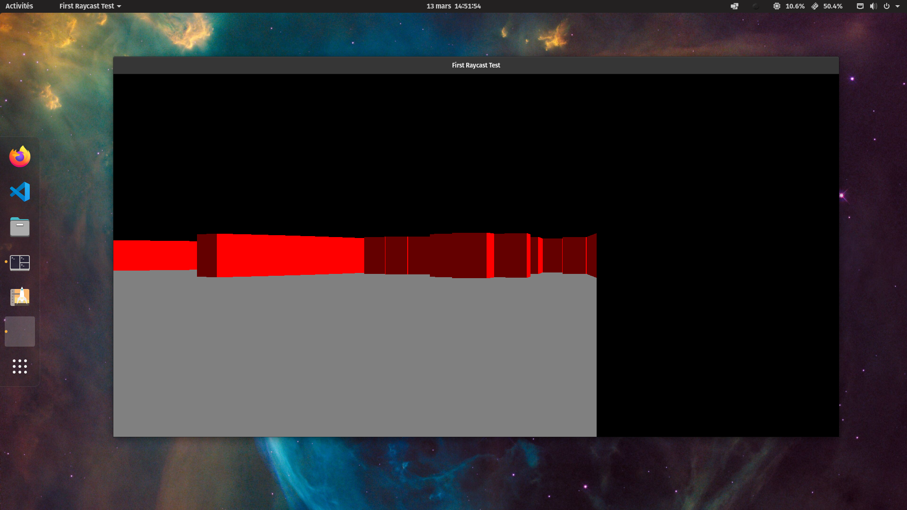

# HomeMade Game With Raycasting principle



Run
```bash
make 
```
to compile the project.

Run 
```bash
make run
```
after compiling the project to launch the program.

You can also run this commands:
```bash
make clean # to clean EXEC and OBJ files
make install # to be able to launch the game from anywhere
make uninstall # to remove the game from install dir 
```
